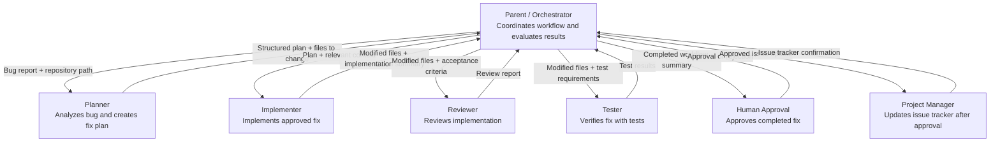

# Orchestration Diagram - Banking Web App Bug Workflow

This workflow coordinates investigation, implementation, review, testing, and human approval for a bug in the BackendCapstone-BankingWeb-app.

## Handoff Summary

The Orchestrator sends the bug report and repository path to the Planner.
The Planner returns a structured fix plan and file list.
The Orchestrator sends the plan to the Implementer.
The Implementer returns modified files and an implementation summary.
The Reviewer checks the implementation against the acceptance criteria.
The Tester verifies the completed fix with tests.
If review or testing fails, the Orchestrator sends the work back for correction.
Once review and tests pass, the Orchestrator requests human approval.
Only after human approval does the Orchestrator invoke the Project Manager.
The Project Manager updates the issue tracker and reports confirmation.

