# # Parallel Agent Session Tasks

This document describes the parallel agent workflow for the target Codebase. Each agent runs in its own Git worktree, feature branch, and container mounted only to its assigned directory. This isolation prevents agents from overwriting each other's changes, reduces merge conflicts, and keeps ownership of changes clear during review.

## Pre-Run Baseline

Before creating either worktree, the repository was checked out to `main` and verified clean. 

Verification:

```bash
git checkout main
git log --oneline -1
git worktree list
```

Actual Output:

```bash
user@DESKTOP-A52GAEQ:/mnt/c/Users/User/downloads/AgenticEngineer/BackendCapstone-BankingWeb-app$ git checkout main
Already on 'main'
Your branch is up to date with 'origin/main'.
user@DESKTOP-A52GAEQ:/mnt/c/Users/User/downloads/AgenticEngineer/BackendCapstone-BankingWeb-app$ git log --oneline -1
e12e3d9 (HEAD -> main, origin/main, origin/HEAD) Build a Sandbox for Coding Agent
user@DESKTOP-A52GAEQ:/mnt/c/Users/User/downloads/AgenticEngineer/BackendCapstone-BankingWeb-app$ git worktree list
/mnt/c/Users/User/downloads/AgenticEngineer/BackendCapstone-BankingWeb-app e12e3d9 [main]
user@DESKTOP-A52GAEQ:/mnt/c/Users/User/downloads/AgenticEngineer/BackendCapstone-BankingWeb-app$
```

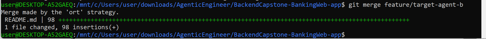

## Session A

**Branch name:** feature/agent-a  
**Worktree directory:** target-agent-a

**Task:**  
Create REST API controller test classes for `AdminController` and `CustomerController` using mocking. The tests should verify controller behavior, HTTP responses, request handling, and service interactions.

**Files the agent may write to:**
- `src/test/java/com/example/demo/AdminControllerTest.java`
- `src/test/java/com/example/demo/CustomerControllerTest.java`

**Files the agent may read but not write to:**
- `src/main/java/com/example/demo/AdminController.java`
- `src/main/java/com/example/demo/CustomerController.java`
- Related service classes
- `pom.xml`
- `README.md`
- Existing test files

**Write restriction:**
The agent may not modify any other source, test, configuration, documentation, or resource file.

**Commands the agent may run:**
- `mvn test`
- `mvn clean test`
- `git status`
- `git diff`

**Definition of done:**
- Test classes are created for `AdminController` and `CustomerController`.
- Tests use mocking frameworks (for example, Mockito with Spring Boot Test).
- REST API endpoints are tested with mocked service dependencies.
- Tests verify expected HTTP status codes and response data.
- All new tests pass successfully using `mvn test`.
- Changes are committed to the assigned branch with a meaningful commit message.

**From the root of your main Target Codebase, create worktree for session A.:**

Confirm the Repository is on the main branch and ensures that both worktrees branch off the same clean baseline, 
which makes the final merge straightforward.

```bash
git checkout main
git pull
git worktree add ../target-agent-a -b feature/agent-a
```
**Verify the worktrees :**

```bash
git worktree list
```

```bash
user@DESKTOP-A52GAEQ:/mnt/c/Users/User/downloads/AgenticEngineer/BackendCapstone-BankingWeb-app$
user@DESKTOP-A52GAEQ:/mnt/c/Users/User/downloads/AgenticEngineer/BackendCapstone-BankingWeb-app$ git worktree add ../target-agent-a -b feature/agent-a
Preparing worktree (new branch 'feature/agent-a')
HEAD is now at cc4d4c1 Build a Sandbox for Your Coding Agent
user@DESKTOP-A52GAEQ:/mnt/c/Users/User/downloads/AgenticEngineer/BackendCapstone-BankingWeb-app$ git worktree add ../target-agent-b -b feature/agent-b
Preparing worktree (new branch 'feature/agent-b')
HEAD is now at cc4d4c1 Build a Sandbox for Your Coding Agent
user@DESKTOP-A52GAEQ:/mnt/c/Users/User/downloads/AgenticEngineer/BackendCapstone-BankingWeb-app$ git worktree list
/mnt/c/Users/User/downloads/AgenticEngineer/BackendCapstone-BankingWeb-app  cc4d4c1 [main]
/mnt/c/Users/User/downloads/AgenticEngineer/target-agent-a                  cc4d4c1 [feature/agent-a]
/mnt/c/Users/User/downloads/AgenticEngineer/target-agent-b                  cc4d4c1 [feature/agent-b]
user@DESKTOP-A52GAEQ:/mnt/c/Users/User/downloads/AgenticEngineer/BackendCapstone-BankingWeb-app$ cd ../target-agent-a
```

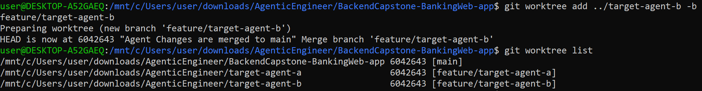

verify worktree is on the correct branch:

```bash
cd ../target-agent-a
ls
git branch
```

```bash
user@DESKTOP-A52GAEQ:/mnt/c/Users/user/downloads/AgenticEngineer/BackendCapstone-BankingWeb-app$ git worktree list
/mnt/c/Users/user/downloads/AgenticEngineer/BackendCapstone-BankingWeb-app  bca5bf5 [main]
/mnt/c/Users/user/downloads/AgenticEngineer/target-agent-a                  6042643 [feature/target-agent-a]
/mnt/c/Users/user/downloads/AgenticEngineer/target-agent-b                  6042643 [feature/target-agent-b]
user@DESKTOP-A52GAEQ:/mnt/c/Users/user/downloads/AgenticEngineer/BackendCapstone-BankingWeb-app$ cd ../target-agent-a
user@DESKTOP-A52GAEQ:/mnt/c/Users/user/downloads/AgenticEngineer/target-agent-a$ ls
Dockerfile     collision_text.txt   mvnw          pom.xml         setup.md       statusline.sh   test.txt
README.md      docker-entrypoint.sh mvnw.cmd      settings.json   src            summary.txt
user@DESKTOP-A52GAEQ:/mnt/c/Users/user/downloads/AgenticEngineer/target-agent-a$ git branch
  feature/agent-a
  feature/agent-b
* feature/target-agent-a
  feature/target-agent-b
  main
user@DESKTOP-A52GAEQ:/mnt/c/Users/user/downloads/AgenticEngineer/target-agent-a$
```

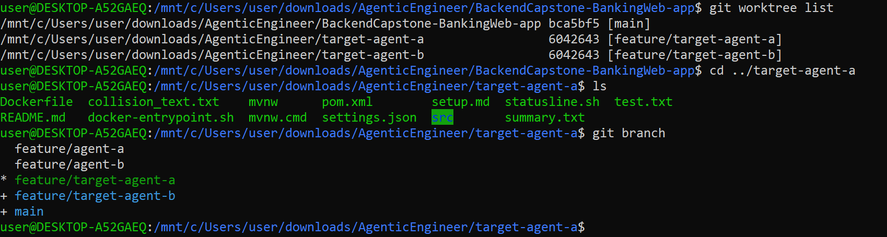

Launch the container in the terminal 1:

docker run -it --rm \
-v "${PWD}:/workspace" \
-v "claude-auth:/claude-auth" \
backend-banking-capstone-app

```bash
user@DESKTOP-A52GAEQ:/mnt/c/Users/User/downloads/AgenticEngineer/target-agent-a$
user@DESKTOP-A52GAEQ:/mnt/c/Users/User/downloads/AgenticEngineer/target-agent-a$ docker run -it --rm -v "${PWD}:/workspace" -v "claude-auth:/claude-auth" backend-banking-capstone-app
ai-course:/workspace#
ai-course:/workspace#
```

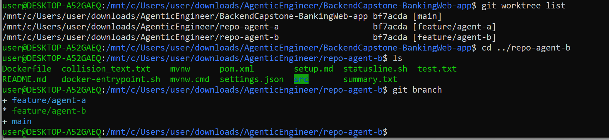

and use Claude inside container to execute the task

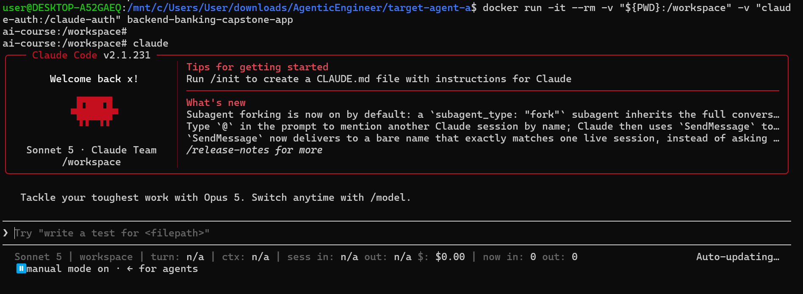

Actual Result:


```bash
Create REST API controller tests with mocking

2026-07-27 21:27:58.657  INFO 1066 --- [           main] o.s.t.web.servlet.TestDispatcherServlet  : Completed initialization in 8 ms
… +69 lines (ctrl+o to expand)
(timeout 5m)

All 46 tests pass across the full suite (30 new + 16 existing), and BankingProjectBackendApplicationTests (Spring context load) also succeeded implicitly.

Created two new test classes using @WebMvcTest + Mockito @MockBean, matching the existing test package convention:

- src/test/java/com/example/demo/AdminControllerTest.java (13 tests) — covers all AdminController endpoints: addAdmin, getAdminByEmail (found/empty), getCustomersByStatus, getAccountsByStatus, getTransactionsByStatus, getTransfersByStatus, getChequeRequestByStatus, and all five update* PUT endpoints.
- src/test/java/com/example/demo/CustomerControllerTest.java (17 tests) — covers all CustomerController endpoints: addCustomer, getCustomerIds, getCustomers, updateCustomer, getUserByEmail (found/empty), addAccount, findAllAccounts, getAccountByCustomer, findAllAccountIds, getAccountIdsByCustomer, getAccountById (present/empty Optional), depositAccount, withdrawAccount, transferAccounts, chequeRequest.

Each test mocks the service layer, sends requests through MockMvc, asserts HTTP status and JSON response body via jsonPath, and verifies the exact service method interaction with Mockito.verify.

Worked for 3m 22s
```

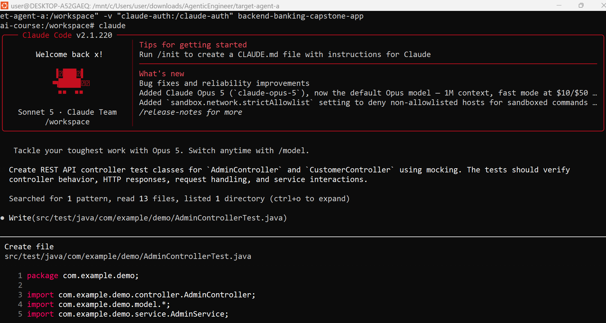

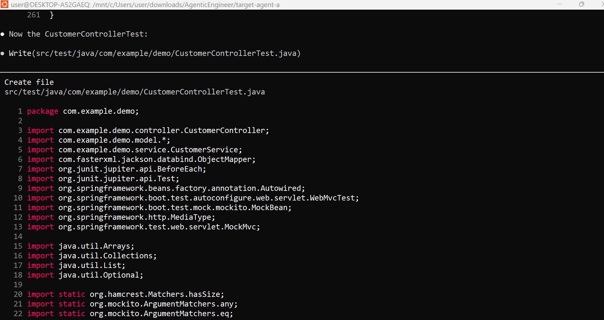

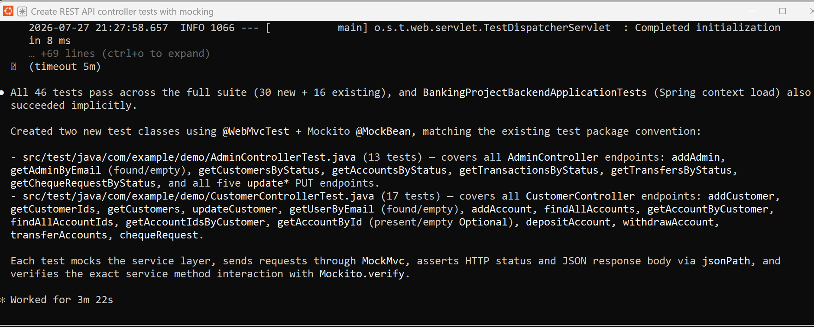

After both agents finish, use git status and git diff main commands in order to inspect each worktree separately against main.

```bash
user@DESKTOP-A52GAEQ:/mnt/c/Users/user/downloads/AgenticEngineer/target-agent-a$ git diff main
diff --git a/src/test/java/com/example/demo/AdminControllerTest.java b/src/test/java/com/example/demo/AdminControllerTest.java
new file mode 100644
index 0000000..33e3c96
--- /dev/null
+++ b/src/test/java/com/example/demo/AdminControllerTest.java
@@ -0,0 +1,261 @@
+package com.example.demo;
+
+import com.example.demo.controller.AdminController;
+import com.example.demo.model.*;
+import com.example.demo.service.AdminService;
+import com.fasterxml.jackson.databind.ObjectMapper;
+import org.junit.jupiter.api.BeforeEach;
+import org.junit.jupiter.api.Test;
+import org.springframework.beans.factory.annotation.Autowired;
+import org.springframework.boot.test.autoconfigure.web.servlet.WebMvcTest;
+import org.springframework.boot.test.mock.mockito.MockBean;
+import org.springframework.http.MediaType;
+import org.springframework.test.web.servlet.MockMvc;
+
+import java.util.Collections;
+import java.util.List;
user@DESKTOP-A52GAEQ: /mnt/c/Users/user/downloads/AgenticEngineer/target-agent-a

```

```bash
user@DESKTOP-A52GAEQ: /mnt/c/Users/user/downloads/AgenticEngineer/target-agent-a

+                .andExpect(jsonPath("$.requestId").value(5));
+
+        verify(adminService, times(1)).updateChequeByStatusId(any(CheckRequest.class), eq(5L));
+    }
+}
diff --git a/src/test/java/com/example/demo/CustomerControllerTest.java b/src/test/java/com/example/demo/CustomerControllerTest.java
new file mode 100644
index 0000000..4c392e6
--- /dev/null
+++ b/src/test/java/com/example/demo/CustomerControllerTest.java
@@ -0,0 +1,313 @@
+package com.example.demo;
+
+import com.example.demo.controller.CustomerController;
+import com.example.demo.model.*;
+import com.example.demo.service.CustomerService;
+import com.fasterxml.jackson.databind.ObjectMapper;
+import org.junit.jupiter.api.BeforeEach;
+import org.junit.jupiter.api.Test;
+import org.springframework.beans.factory.annotation.Autowired;
+import org.springframework.boot.test.autoconfigure.web.servlet.WebMvcTest;
+import org.springframework.boot.test.mock.mockito.MockBean;
+import org.springframework.http.MediaType;
+import org.springframework.test.web.servlet.MockMvc;
+
+import java.util.Arrays;
+import java.util.Collections;
+import java.util.List;
+import java.util.Optional;
+
```

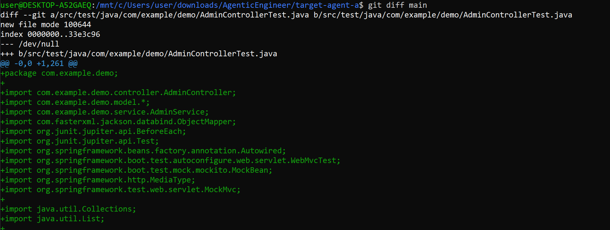
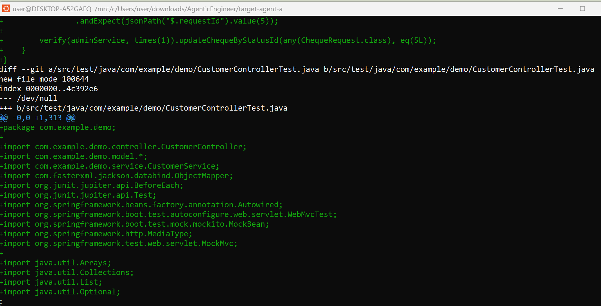


## Session B

**Branch name:** feature/agent-b  
**Worktree directory:** target-agent-b

**Task:**  
Update README.md with documentation describing the parallel multi-agent workflow, including worktree setup, agent responsibilities, container execution, and merge workflow.

**Files or folders the agent may write to:**
- `README.md`

**Files or folders the agent may read but not write to:**
- `src/main/java/**`
- `src/test/java/**`
- `pom.xml`
- Existing application source files

**Commands the agent may run:**
- `git status`
- `git diff`
- `git log`
- `git branch`
- `mvn test` (optional verification only)

**Definition of done:**
- README.md contains clear documentation of the parallel agent workflow.
- Documentation explains worktree creation, container execution, and merge process.
- Changes are committed with a meaningful commit message.

**From the root of your main target Codebase, create worktree for session B.:**

Confirm the Repository is on the main branch and ensures that both worktrees branch off the same clean baseline,
which makes the final merge straightforward.

```bash
git checkout main
git pull
git worktree add ../target-agent-b -b feature/agent-b
```

**Verify the worktrees :**

```bash
git worktree list
```

```bash
user@DESKTOP-A52GAEQ:/mnt/c/Users/User/downloads/AgenticEngineer/BackendCapstone-BankingWeb-app$
user@DESKTOP-A52GAEQ:/mnt/c/Users/User/downloads/AgenticEngineer/BackendCapstone-BankingWeb-app$ git worktree add ../target-agent-a -b feature/agent-a
Preparing worktree (new branch 'feature/agent-a')
HEAD is now at cc4d4c1 Build a Sandbox for Your Coding Agent
user@DESKTOP-A52GAEQ:/mnt/c/Users/User/downloads/AgenticEngineer/BackendCapstone-BankingWeb-app$ git worktree add ../target-agent-b -b feature/agent-b
Preparing worktree (new branch 'feature/agent-b')
HEAD is now at cc4d4c1 Build a Sandbox for Your Coding Agent
user@DESKTOP-A52GAEQ:/mnt/c/Users/User/downloads/AgenticEngineer/BackendCapstone-BankingWeb-app$ git worktree list
/mnt/c/Users/User/downloads/AgenticEngineer/BackendCapstone-BankingWeb-app  cc4d4c1 [main]
/mnt/c/Users/User/downloads/AgenticEngineer/target-agent-a                  cc4d4c1 [feature/agent-a]
/mnt/c/Users/User/downloads/AgenticEngineer/target-agent-b                  cc4d4c1 [feature/agent-b]
user@DESKTOP-A52GAEQ:/mnt/c/Users/User/downloads/AgenticEngineer/BackendCapstone-BankingWeb-app$ cd ../target-agent-a
```


verify worktree is on the correct branch:

```bash
cd ../target-agent-b
ls
git branch
```

```bash
user@DESKTOP-A52GAEQ:/mnt/c/Users/user/downloads/AgenticEngineer/BackendCapstone-BankingWeb-app$ cd ../target-agent-b
user@DESKTOP-A52GAEQ:/mnt/c/Users/user/downloads/AgenticEngineer/target-agent-b$ ls
Dockerfile     collision_text.txt   mvnw          pom.xml         setup.md       statusline.sh   test.txt
README.md      docker-entrypoint.sh mvnw.cmd      settings.json   src            summary.txt
user@DESKTOP-A52GAEQ:/mnt/c/Users/user/downloads/AgenticEngineer/target-agent-b$ git branch
feature/agent-a
feature/agent-b
+ feature/target-agent-a
* feature/target-agent-b
+ main
  user@DESKTOP-A52GAEQ:/mnt/c/Users/user/downloads/AgenticEngineer/target-agent-b$
+ ```
  
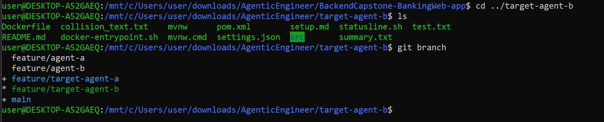

Launch the container in the terminal 2:

docker run -it --rm \
-v "${PWD}:/workspace" \
-v "claude-auth:/claude-auth" \
backend-banking-capstone-app

and use Claude inside container to execute the task
```bash
user@DESKTOP-A52GAEQ:/mnt/c/Users/User/downloads/AgenticEngineer/target-agent-b$ docker run -it --rm \
  -v "${PWD}:/workspace" \
  -v "claude-auth:/claude-auth" \
  backend-banking-capstone-app
ai-course:/workspace# ls /workspace
Dockerfile     docker-entrypoint.sh   img_10.png   img_12.png   mvnw       pom.xml         setup.md       statusline.sh   test.txt
README.md      img_1.png              img_11.png   img_9.png    mvnw.cmd   settings.json   src            summary.txt
```

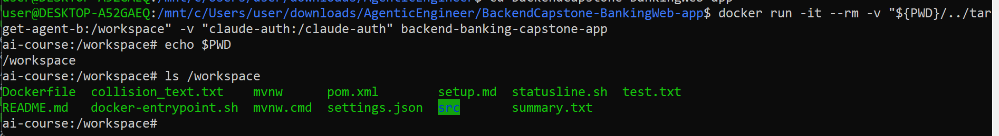

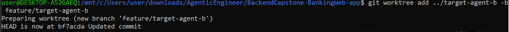

Actual Result:

```bash
responsibilities, container execution, and merge workflow.

I'll inspect the repo first to make sure the documentation matches the actual setup.

Read 8 files, listed 1 directory (ctrl+o to expand)

User answered Claude's questions:
  · How are responsibilities split across the parallel agents in this workflow? → Feature/module split
  · How should completed work from each agent's worktree get back into main? → PR-based review (Recommended)

Update(README.md)

Edit file
README.md

    8   Account Management: Provides APIs to perform operations on bank accounts, including balance updates, currency formatting, branch assignments, and linking accounts to customer profiles via primary/foreign key relationships.
    9
    10  Database Integration: Utilizes JPA annotations, sequence generators, and relational tables (customer, account, bank_admin) to ensure data integrity and transactional consistency.
    11 +
    12 +## Parallel Multi-Agent Workflow
    13 +
    14 +To speed up development, multiple Claude Code agents can work on different parts of the
    15 +codebase at the same time, each isolated in its own `git worktree` and its own container.
    16 +Every agent owns a distinct feature area, so their changes rarely touch the same files, which
    17 +keeps merge conflicts to a minimum.
    18 +
    19 +### 1. Worktree Setup
    20 +
    21 +Each agent gets its own working directory (worktree) and branch, created from an up-to-date
```
    
```bash
Document parallel multi-agent workflow in README

    103 +```bash
    104 +git fetch origin
    105 +git merge origin/main
    106 +```
    107 +6. After merging, remove the completed agent's worktree and branch (see Worktree Setup) to keep
    108 +the working tree list clean.

Added a "Parallel Multi-Agent Workflow" section to README.md covering:

- Worktree setup — git worktree add per agent/branch, directory layout, cleanup steps
- Agent responsibilities — a table splitting ownership by feature (roles, customers, accounts, db integration), matching the app's existing feature set from the top of the README
- Container execution — one container per agent, each mounting only its own worktree plus a per-agent claude-auth volume, built on the existing Dockerfile, cross-referencing the isolation decisions already documented in setup.md
- Merge workflow — commit/push → PR into main → review + CI check → merge → other agents sync main back into their worktrees → worktree/branch cleanup

Since none of this existed in the repo before, I based module ownership on the four feature areas already described in the README and kept container/isolation details consistent with the existing Dockerfile/docker-entrypoint.sh/setup.md. Let me know if you'd like different branch names, agent count, or a stricter/looser merge process (e.g. squash-only, required approvals).

Worked for 56s
```

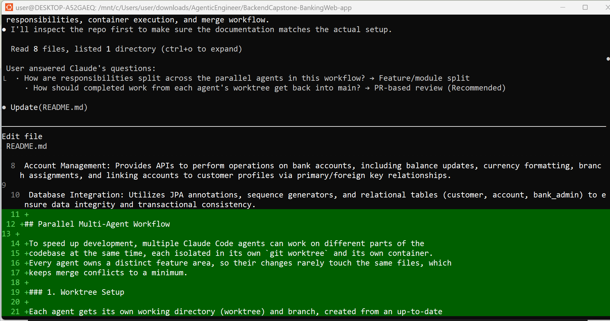

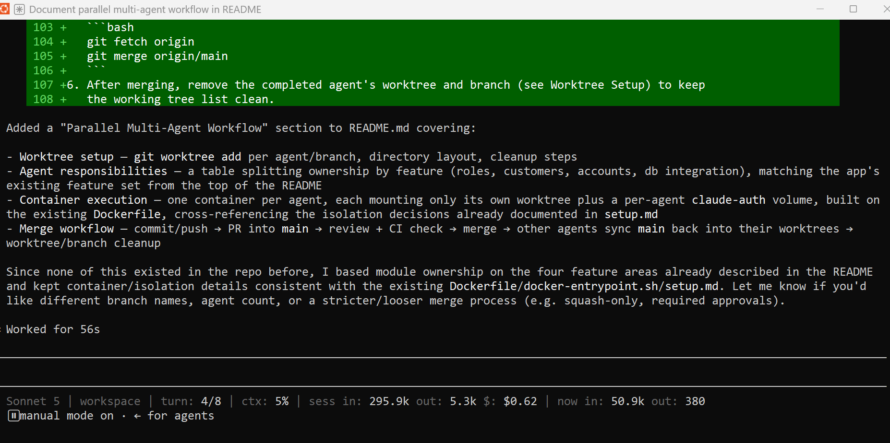

After both agents finish, use git status and git diff main commands in order to inspect each worktree separately against main.

```bash
user@DESKTOP-A52GAEQ:/mnt/c/Users/user/downloads/AgenticEngineer/BackendCapstone-BankingWeb-app$
exit
user@DESKTOP-A52GAEQ:/mnt/c/Users/user/downloads/AgenticEngineer/BackendCapstone-BankingWeb-app$ cd ../target-agent-b && git diff main
diff --git a/README.md b/README.md
index 95cac09..8907879 100644
--- a/README.md
+++ b/README.md
@@ -8,3 +8,101 @@ Customer Profile Service: Handles customer records, personal details, contact in
Account Management: Provides APIs to perform operations on bank accounts, including balance updates, currency formatting, branch assignments, and linking accounts to customer profiles via primary/foreign key relationships.

Database Integration: Utilizes JPA annotations, sequence generators, and relational tables (customer, account, bank_admin) to ensure data integrity and transactional consistency.
+
+## Parallel Multi-Agent Workflow
+
+To speed up development, multiple Claude Code agents can work on different parts of the
+codebase at the same time, each isolated in its own `git worktree` and its own container.
+Every agent owns a distinct feature area, so their changes rarely touch the same files, which
+keeps merge conflicts to a minimum.
+
+### 1. Worktree Setup
+
+Each agent gets its own working directory (worktree) and branch, created from an up-to-date
+`main`, so agents never share uncommitted state:
+
+```bash
+git fetch origin
+git worktree add ../capstone-agent-roles     -b agent/roles      origin/main
+git worktree add ../capstone-agent-customers -b agent/customers  origin/main
```

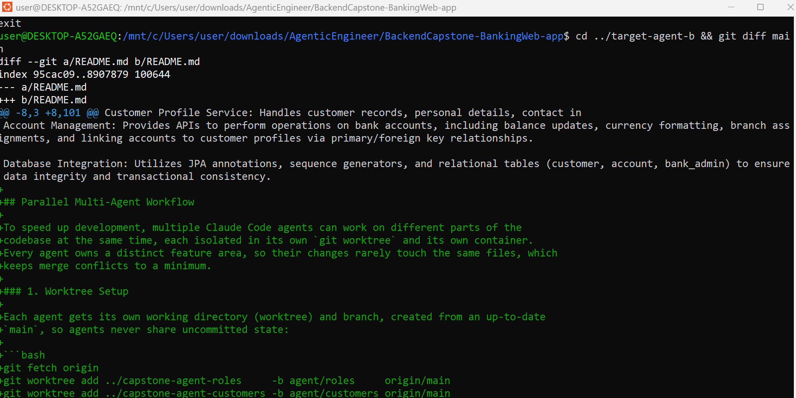

## Why These Tasks Can Run in Parallel

The two sessions were intentionally assigned non-overlapping write scopes.

- **Session A** writes only to:
    - `src/test/java/com/example/demo/AdminControllerTest.java`
    - `src/test/java/com/example/demo/CustomerControllerTest.java`
- **Session B** writes only to:
    - `README.md`

Both sessions are allowed to read the production source code, `pom.xml`, and other existing application files, but neither session is permitted to modify them. Keeping these shared resources read-only ensures both agents work from the same codebase without introducing conflicting changes.

Because each session writes to a different part of the repository, they cannot overwrite each other's work or create file-level merge conflicts during development.

If both sessions were allowed to modify the same files (for example, `README.md`, `pom.xml`, or the controller source files), concurrent edits could result in merge conflicts, accidental overwrites, or difficulty determining which changes belong to each task. Restricting each session to separate write scopes keeps the work independent and makes review and merging straightforward.

## Shared Files Excluded From Write Scope

Both sessions were allowed to read shared files such as:

- `src/main/java/**`
- `pom.xml`
- Existing application source files

These files were excluded from write access because parallel changes to production code or shared configuration could create conflicts or unintended changes. Keeping them read-only allowed both agents to work independently and made merging safer.

## Evaluation and Merge Verification

Each agent branch was reviewed independently against `main` before merging.

### Session A

```bash
cd ../target-agent-a
git status
git diff main
```
```bash
user@DESKTOP-A52GAEQ:/mnt/c/Users/User/downloads/AgenticEngineer/target-agent-a$ git diff main
diff --git a/src/test/java/com/example/demo/AdminControllerTest.java b/src/test/java/com/example/demo/AdminControllerTest.java
new file mode 100644
index 0000000..7074e5b
diff --git a/src/test/java/com/example/demo/AdminControllerTest.java b/src/test/java/com/example/demo/AdminControllerTest.java
new file mode 100644
index 0000000..7074e5b
--- /dev/null
+++ b/src/test/java/com/example/demo/AdminControllerTest.java
@@ -0,0 +1,315 @@
+package com.example.demo;
+
+import com.example.demo.controller.AdminController;
+import com.example.demo.model.*;
+import com.example.demo.service.AdminService;
+import com.fasterxml.jackson.databind.ObjectMapper;
+import org.junit.jupiter.api.BeforeEach;
+import org.junit.jupiter.api.Test;
+import org.junit.jupiter.api.extension.ExtendWith;
+import org.springframework.beans.factory.annotation.Autowired;
+import org.springframework.boot.test.autoconfigure.web.servlet.WebMvcTest;
+import org.springframework.boot.test.mock.mockito.MockBean;
+import org.springframework.http.MediaType;
+import org.springframework.test.context.junit.jupiter.SpringExtension;
```

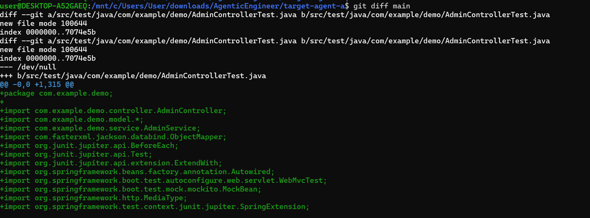

**Correctness and usefulness:**  
The agent added `AdminControllerTest.java` and `CustomerControllerTest.java`. The tests cover the assigned controller behavior, mocked service interactions, HTTP responses, and response data. `mvn test` completed successfully.

**Scope adherence:**  
`git diff main` showed only:
- `src/test/java/com/example/demo/AdminControllerTest.java`
- `src/test/java/com/example/demo/CustomerControllerTest.java`

No production source, README, configuration, or unrelated test files were modified.

**Production appropriateness:**  
The changes add automated controller test coverage without modifying application behavior or production source code. The tests passed successfully, so the changes were considered appropriate to merge.

**Definition of done:**  
All assigned test classes were created, mocking was used, the required endpoint behavior was tested, tests passed, and the branch was committed.

**Merge decision:** Approved.

**Reason:** The diff matched the assigned file-level scope and the successful test execution demonstrated that the required controller test coverage was functional.

### Session B

```bash
cd ../target-agent-b
git status
git diff main
```

```bash
user@DESKTOP-A52GAEQ:/mnt/c/Users/User/downloads/AgenticEngineer/target-agent-b$ git diff main
diff --git a/README.md b/README.md
index a84b71a..d1de653 100644
diff --git a/README.md b/README.md
index a84b71a..d1de653 100644
--- a/README.md
+++ b/README.md
@@ -21,3 +21,102 @@ Database Integration: The application uses MySQL with JPA/Hibernate to persist c
 **Architecture and Code Structure:**

 The backend follows a layered Spring Boot architecture, with controllers responsible for REST endpoints, services containing business logic, repositories providing database access through Spring Data JPA, and model/entity classes representing the application's relational data. The application separates customer and administrator functionality, allowing banking operations and administrative approval workflows to be developed and maintained independently.
+
+## Parallel Multi-Agent Workflow
+
+This repository uses a dual-agent workflow
```


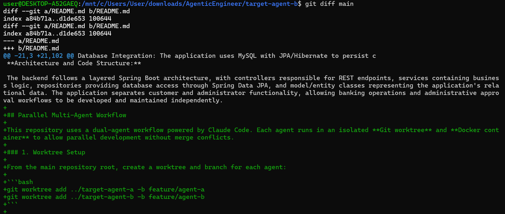

**Correctness and usefulness:**  
The agent updated `README.md` with documentation covering the parallel workflow, worktree setup, container execution, agent responsibilities, and merge process.

**Scope adherence:**  
`git diff main ` showed only: `README.md`

No source, test, configuration, or other files were modified.

**Production appropriateness:**  
The change is documentation-only and does not alter application behavior. The documentation is appropriate for explaining the demonstrated workflow.

**Definition of done:**  
The README contains the required workflow documentation and the branch was committed with a meaningful commit message.

**Merge decision:** Approved.

**Reason:** The diff contained only the assigned README change and satisfied the Session B definition of done.

### Merge

```bash
cd ../BackendCapstone-BankingWeb-app
git merge feature/agent-a
git merge feature/agent-b
git log --oneline -5
git status
```
The merge was performed only after reviewing each branch with `git diff main`. The merge commands were executed for both feature branches, followed by git log --oneline -5 and git status to verify the resulting repository state.

```bash
user@DESKTOP-A52GAEQ:/mnt/c/Users/User/downloads/AgenticEngineer/BackendCapstone-BankingWeb-app$ git merge feature/agent-a
Updating cc4d4c1..3e6e7bd
Fast-forward
 src/test/java/com/example/demo/AdminControllerTest.java    | 315 ++++++++++++++++++++++++++++++++++++++++++++++++++++++++++++++++++++++
 src/test/java/com/example/demo/CustomerControllerTest.java | 347 +++++++++++++++++++++++++++++++++++++++++++++++++++++++++++++++++++++++++++
 2 files changed, 662 insertions(+)
 create mode 100644 src/test/java/com/example/demo/AdminControllerTest.java
 create mode 100644 src/test/java/com/example/demo/CustomerControllerTest.java
user@DESKTOP-A52GAEQ:/mnt/c/Users/User/downloads/AgenticEngineer/BackendCapstone-BankingWeb-app$ git log --oneline -5

user@DESKTOP-A52GAEQ:/mnt/c/Users/User/downloads/AgenticEngineer/BackendCapstone-BankingWeb-app$ git checkout main
Already on 'main'
Your branch is up to date with 'origin/main'.
user@DESKTOP-A52GAEQ:/mnt/c/Users/User/downloads/AgenticEngineer/BackendCapstone-BankingWeb-app$ git log --oneline -1
e12e3d9 (HEAD -> main, origin/main, origin/HEAD) Build a Sandbox for Coding Agent
user@DESKTOP-A52GAEQ:/mnt/c/Users/User/downloads/AgenticEngineer/BackendCapstone-BankingWeb-app$ git worktree list
/mnt/c/Users/User/downloads/AgenticEngineer/BackendCapstone-BankingWeb-app e12e3d9 [main]
user@DESKTOP-A52GAEQ:/mnt/c/Users/User/downloads/AgenticEngineer/BackendCapstone-BankingWeb-app$

user@DESKTOP-A52GAEQ:/mnt/c/Users/User/downloads/AgenticEngineer/BackendCapstone-BankingWeb-app$ git log --oneline -5
c1747e4 (HEAD -> main, origin/main, feature/agent1a-a, feature/agent-b, feature/agent-a) Merge branch 'feature/agent-b'
be8ba9e README.md updated with Parallel Multi-Agent Workflow
3e6e7bd test: add AdminControllerTest and CustomerControllerTest
cc4d4c1 Build a Sandbox for Your Coding Agent
157c05e Build a Sandbox for Your Coding Agent
user@DESKTOP-A52GAEQ:/mnt/c/Users/User/downloads/AgenticEngineer/BackendCapstone-BankingWeb-app$
user@DESKTOP-A52GAEQ:/mnt/c/Users/User/downloads/AgenticEngineer/BackendCapstone-BankingWeb-app$
```

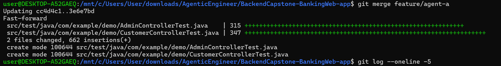


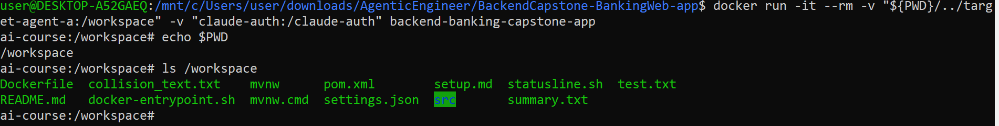

## Final Cleanup

```bash
git worktree remove ../target-agent-a
git worktree remove ../target-agent-b

git worktree list

git status
```

Expected result:

- Only the main worktree remains.
- `git status` reports a clean working tree.

Screenshot:

```bash
user@DESKTOP-A52GAEQ:/mnt/c/Users/user/downloads/AgenticEngineer/BackendCapstone-BankingWeb-app$
user@DESKTOP-A52GAEQ:/mnt/c/Users/user/downloads/AgenticEngineer/BackendCapstone-BankingWeb-app$ git worktree remove ../target-agent-a
user@DESKTOP-A52GAEQ:/mnt/c/Users/user/downloads/AgenticEngineer/BackendCapstone-BankingWeb-app$ git worktree remove ../target-agent-b

user@DESKTOP-A52GAEQ:/mnt/c/Users/user/downloads/AgenticEngineer/BackendCapstone-BankingWeb-app$ git worktree list
/mnt/c/Users/user/downloads/AgenticEngineer/BackendCapstone-BankingWeb-app 6042643 [main]
user@DESKTOP-A52GAEQ:/mnt/c/Users/user/downloads/AgenticEngineer/BackendCapstone-BankingWeb-app$
```


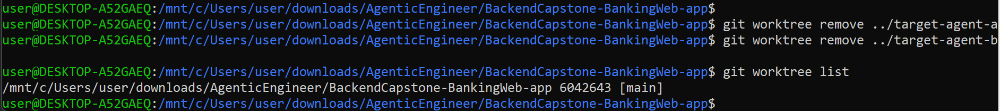


## Reflection

### Q1. What did you learn about defining parallel agent tasks?

This run showed that parallel tasks need both separate responsibilities and explicit file-level write boundaries. Session A focused on controller tests while Session B focused on README documentation, so the two tasks could be executed independently. Defining the expected output files also made post-run scope verification easier.

### Q2. How did the task definitions affect agent behavior?

Session A was directed to create only the two controller test classes, while Session B was directed to modify only README.md. This gave each agent a clear target and prevented the tasks from competing for the same files.

### Q3. What happened with merge conflicts, and why?

The branches merged without a file-level conflict because the write scopes were separated before the agents started. Session A modified the assigned test files and Session B modified README.md. The clean merge was therefore a result of deliberate task decomposition rather than relying on the agents to avoid each other's files.

### Q4. What judgment call required human oversight?

The worktree and container setup could verify branch and filesystem isolation, but it could not determine whether the generated tests provided meaningful coverage or whether the README documentation was sufficiently useful and production-appropriate. Those aspects required human review of the actual diffs and test results.

### Q5. How did the scope definition affect the merge outcome?

The non-overlapping scopes made the branches independently reviewable and reduced the possibility of conflicting edits. The Session A test files and Session B README change could be merged without competing modifications to the same file.

### Q6. What would you change in the next run?

I would keep the two-task decomposition but make the agent instructions even more explicit by naming every expected output file and requiring each agent to run `git diff main` before committing. Better file-level scoping would catch unintended changes earlier, while a corrective prompt would still be useful if an agent began drifting from its assigned task during execution.