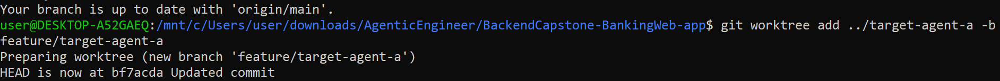
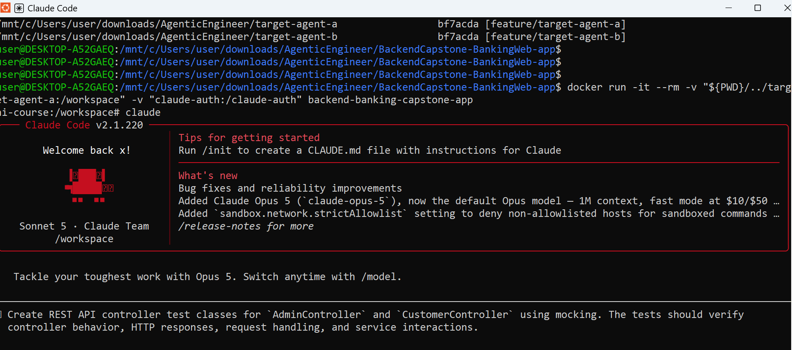
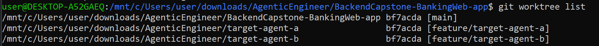
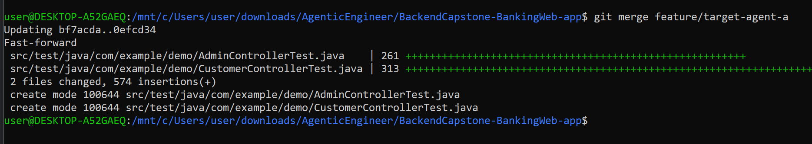

# # Parallel Agent Session Tasks

This document describes the parallel agent workflow for the target Codebase. Each agent runs in its own Git worktree, feature branch, and container mounted only to its assigned directory. This isolation prevents agents from overwriting each other's changes, reduces merge conflicts, and keeps ownership of changes clear during review.

## Session A

**Branch name:** feature/target-agent-a  
**Worktree directory:** target-agent-a

**Task:**  
Create REST API controller test classes for `AdminController` and `CustomerController` using mocking. The tests should verify controller behavior, HTTP responses, request handling, and service interactions.

**Files or folders the agent may write to:**
- `src/test/java/**`
- `src/test/resources/**` (if required for test configuration)

**Files or folders the agent may read but not write to:**
- `src/main/java/**`
- `pom.xml`
- `README.md`
- Existing production source files

**Commands the agent may run:**
- `mvn test`
- `mvn clean test`
- `git status`
- `git diff`

**Definition of done:**
- Test classes are created for `AdminController` and `CustomerController`.
- Tests use mocking frameworks (for example, Mockito with Spring Boot Test).
- REST API endpoints are tested with mocked service dependencies.
- Tests verify expected HTTP status codes and response data.
- All new tests pass successfully using `mvn test`.
- Changes are committed to the assigned branch with a meaningful commit message.

**From the root of your main Target Codebase, create worktree for session A.:**

Confirm the Repository is on the main branch and ensures that both worktrees branch off the same clean baseline, 
which makes the final merge straightforward.

```bash
git checkout main
git pull
git worktree add ../target-agent-a -b feature/target-agent-a
```


**Verify the worktrees :**

```bash
git worktree list
```

verify worktree is on the correct branch:

```bash
cd ../target-agent-a
ls
git branch
```


Launch the container in the terminal 1:

docker run -it --rm \
-v "${PWD}/../target-agent-a:/workspace" \
-v "claude-auth:/claude-auth" \
backend-banking-capstone-app

and use Claude inside container to execute the task



Actual Result:


After both agents finish, use git status and git diff main commands in order to inspect each worktree separately against main.


## Session B

**Branch name:** feature/target-agent-b  
**Worktree directory:** target-agent-b

**Task:**  
Update README.md with documentation describing the parallel multi-agent workflow, including worktree setup, agent responsibilities, container execution, and merge workflow.

**Files or folders the agent may write to:**
- `README.md`

**Files or folders the agent may read but not write to:**
- `src/main/java/**`
- `src/test/java/**`
- `pom.xml`
- Existing application source files

**Commands the agent may run:**
- `git status`
- `git diff`
- `git log`
- `git branch`
- `mvn test` (optional verification only)

**Definition of done:**
- README.md contains clear documentation of the parallel agent workflow.
- Documentation explains worktree creation, container execution, and merge process.
- Changes are committed with a meaningful commit message.

**From the root of your main target Codebase, create worktree for session B.:**

Confirm the Repository is on the main branch and ensures that both worktrees branch off the same clean baseline,
which makes the final merge straightforward.

```bash
git checkout main
git pull
git worktree add ../target-agent-b -b feature/target-agent-b
```


**Verify the worktrees :**

```bash
git worktree list
```



verify worktree is on the correct branch:

```bash
cd ../target-agent-b
ls
git branch
```


Launch the container in the terminal 2:

docker run -it --rm \
-v "${PWD}/../target-agent-b:/workspace" \
-v "claude-auth:/claude-auth" \
backend-banking-capstone-app

and use Claude inside container to execute the task


After both agents finish, use git status and git diff main commands in order to inspect each worktree separately against main.


## Why These Tasks Can Run in Parallel

The two sessions were intentionally assigned non-overlapping write scopes.

- **Session A** writes only under `src/test/java/**` and `src/test/resources/**`.
- **Session B** writes only to `README.md`.

Both sessions are allowed to read the production source code, `pom.xml`, and other existing application files, but neither session is permitted to modify them. Keeping these shared resources read-only ensures both agents work from the same codebase without introducing conflicting changes.

Because each session writes to a different part of the repository, they cannot overwrite each other's work or create file-level merge conflicts during development.

If both sessions were allowed to modify the same files (for example, `README.md`, `pom.xml`, or the controller source files), concurrent edits could result in merge conflicts, accidental overwrites, or difficulty determining which changes belong to each task. Restricting each session to separate write scopes keeps the work independent and makes review and merging straightforward.

## Shared Files Excluded From Write Scope

Both sessions were allowed to read shared files such as:

- `src/main/java/**`
- `pom.xml`
- Existing application source files

These files were intentionally excluded from both write scopes because modifying production code or shared configuration files in parallel could create merge conflicts or introduce unintended application changes.

By keeping shared files read-only, each agent could independently complete its task while the final changes remained easy to review and merge.

For each session, note the following:

## Merge Verification

After both agents finish their tasks, inspect each worktree separately against the main branch with below commands,
The final git history confirms both agent branches were merged successfully.

```bash
cd ../BackendCapstone-BankingWeb-app
git status
git diff main
git merge feature/target-agent-a
git merge feature/target-agent-b
git log --oneline -5
```
The merge was performed only after reviewing each branch with `git diff main`. The final git log confirms that both feature branches were integrated into the main branch.




## Final Cleanup

```bash
git worktree remove ../target-agent-a
git worktree remove ../target-agent-b

git worktree list

git status
```

Expected result:

- Only the main worktree remains.
- `git status` reports a clean working tree.

Screenshot:


## Evaluation

### Session A

Planned write scope:
- `src/test/java/**`
- `src/test/resources/**`

Actual changes:
- Added `AdminControllerTest.java`
- Added `CustomerControllerTest.java`
- No production source files or README were modified.

Verification:
- `git diff main` showed changes only under `src/test/java`.
- `mvn test` completed successfully.

Evaluation reasoning:
The diff showed that the agent modified only the approved test directory and did not touch production code. This matched the original scope contract. Since the tests passed and the changes only added controller test coverage, the branch was considered safe and production-appropriate.

Merge decision:
Approved for merge.

Conclusion:
The agent stayed within the assigned scope, completed the definition of done, and the changes were merged into main.


### Session B

Planned write scope:
- `README.md`

Actual changes:
- Updated `README.md` with documentation describing the parallel multi-agent workflow.
- No source code or test files were modified.

Verification:
- `git diff main` showed changes only to `README.md`.

Evaluation reasoning:
The diff confirmed that the agent changed only the file explicitly allowed in the write scope. Because no application source files or tests were changed, the documentation update could be reviewed independently without affecting application behavior.

Merge decision:
Approved for merge.

Conclusion:
The agent stayed within the assigned scope, completed the definition of done, and the changes were merged into main.
