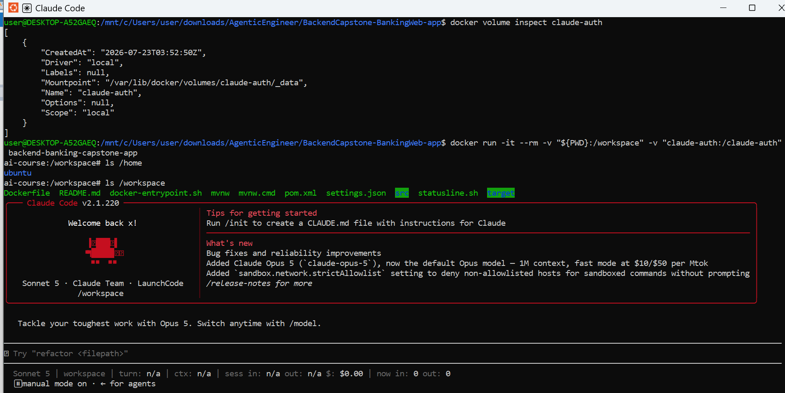
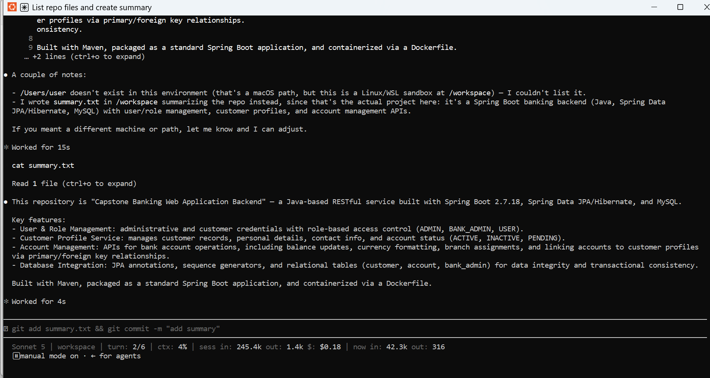
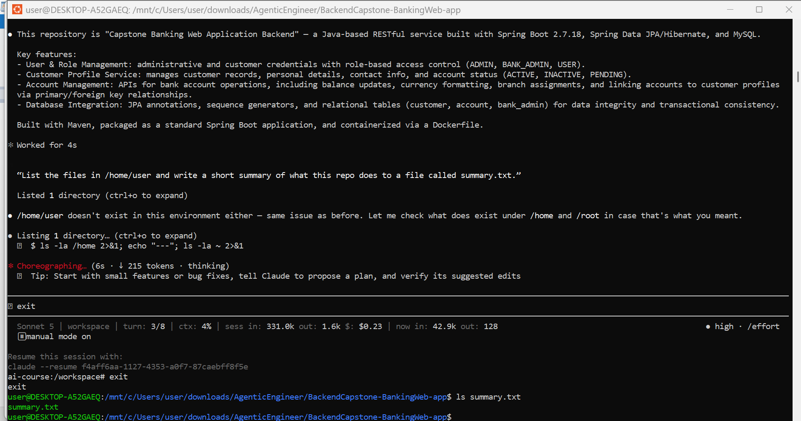
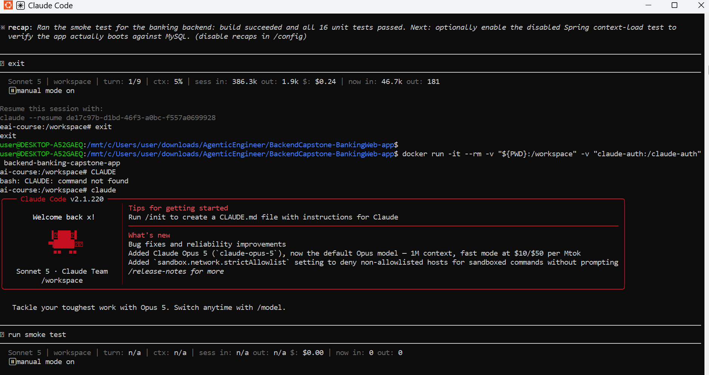
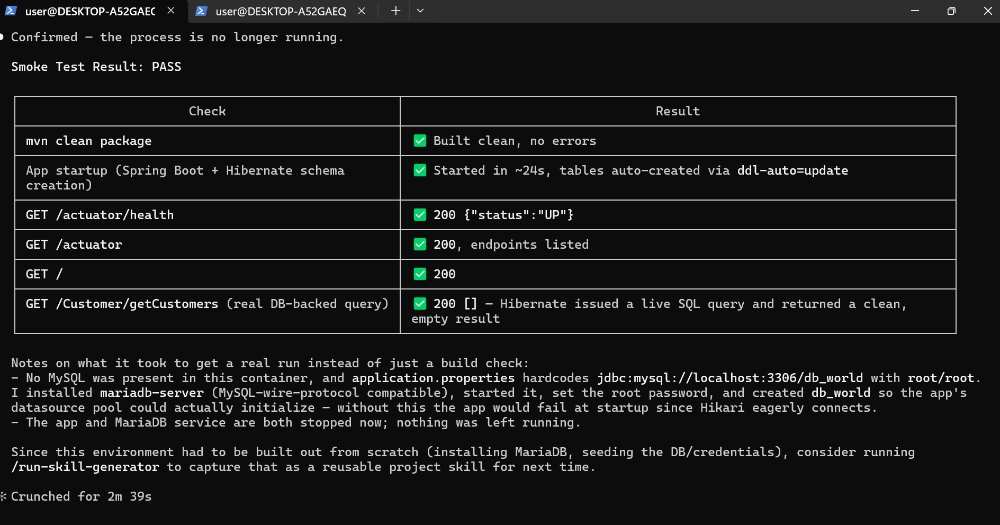

# Setup & Execution Guide

This document contains the commands required to build, run, and verify the application.

## 1. Build the Docker Image

```bash
docker build -t backend-banking-capstone-app .
```

-----------------------------------------------------------------------------------------------------------------

## 2. Run the Container

### Standard Run 

```bash
docker run -it --rm \
  -v "${PWD}:/workspace" \
  -v "claude-auth:/claude-auth" \
  backend-banking-capstone-app
```
-----------------------------------------------------------------------------------------------------------------
### 3. Network Access

**Decision:** The standard container uses Docker's default bridge network.

**Reason:** The Claude CLI requires outbound network connectivity to communicate
with its service. Network access is therefore enabled during normal agent-assisted
development.

**Verification:** Running `curl -I https://www.google.com` inside the standard
container returned `HTTP/2 200`, confirming that outbound network access was
available.

**Risk Prevented:** Network access is not required when performing offline
validation. A compromised or misbehaving agent with unrestricted network access
could potentially send project information to an external service.

**Mitigation:** When network access is not required, the container is run with
`--network none`. The isolated test produced a DNS/network failure, confirming
that outbound network access was disabled.

Actual result:

```bash
user@DESKTOP-A52GAEQ:/mnt/c/Users/user/downloads/AgenticEngineer/BackendCapstone-BankingWeb-app$
user@DESKTOP-A52GAEQ:/mnt/c/Users/user/downloads/AgenticEngineer/BackendCapstone-BankingWeb-app$ docker run -it --rm -v "${PWD}:/workspace" -v "~/.claude-auth:/claude-auth" backend-banking-capstone-app
backend-banking-capstone-app
root@...:/workspace# curl -I https://www.google.com
HTTP/2 200
content-type: text/html; charset=ISO-8859-1
content-security-policy-report-only: object-src 'none';base-uri 'self';script-src 'nonce-Daw6c_sb6AF4V9915t7rSW' 'strict-dynamic' 'report-sample' 'unsafe-eval' 'unsafe-inline' https: http:;report-sample https://csp.withgoogle.com/csp/gws/other-hp
accept-ch: Sec-CH-Prefers-Color-Scheme
age: CP="This is not a P3P policy! See g.co/p3phelp for more info."
date: Sun, 26 Jul 2026 19:51:01 GMT
server: gws
x-xss-protection: 0
x-frame-options: SAMEORIGIN
expires: Sun, 26 Jul 2026 19:51:01 GMT
cache-control: private
set-cookie: __Secure-STRP=...
set-cookie: AEC=...
set-cookie: NID=...
alt-svc: h3=":443"; ma=2592000, h3-29=":443"; ma=2592000

```


-----------------------------------------------------------------------------------------------------------------

### Isolated Run (No Network Access)

Useful for security or offline testing.

```bash
docker run -it --rm \
  --network none \
  -v "${PWD}:/workspace" \
  backend-banking-capstone-app
```

```bash
curl -I https://www.google.com
```

Check whether the container can reach the network.

Actual result:

```bash
user@DESKTOP-A52GAEQ:/mnt/c/Users/user/downloads/AgenticEngineer/BackendCapstone-BankingWeb-app$ docker run -it --rm --network none -v "${PWD}:/workspace" backend-banking-capstone-app
ai-course:/workspace# curl -I https://www.google.com
curl: (6) Could not resolve host: www.google.com
ai-course:/workspace#
```


-----------------------------------------------------------------------------------------------------------------
## 4. Smoke Test

After entering the container, I launched the claude CLI by running:
  ```bash
  claude
```

  
  
Prompt executed in the claude CLI:

The first prompt:

“List the files in /workspace and write a short summary of what this repo does to a file called summary.txt.”

Actual Result:

```bash
A couple of notes:

- /Users/user doesn't exist in this environment (that's a macOS path, but this is a Linux/WSL sandbox at /workspace) — I couldn't list it.
- I wrote summary.txt in /workspace summarizing the repo instead, since that's the actual project here: it's a Spring Boot banking backend (Java, Spring Data JPA/Hibernate, MySQL) with user/role management, customer profiles, and account management APIs.

If you meant a different machine or path, let me know and I can adjust.

Worked for 15s

cat summary.txt

Read 1 file (ctrl+o to expand)

This repository is "Capstone Banking Web Application Backend" — a Java-based RESTful service built with Spring Boot 2.7.18, Spring Data JPA/Hibernate, and MySQL.

Key features:
- User & Role Management: administrative and customer credentials with role-based access control (ADMIN, BANK_ADMIN, USER).
- Customer Profile Service: manages customer records, personal details, contact info, and account statuses (ACTIVE, INACTIVE, PENDING).
- Account Management: APIs for bank account operations, including balance updates, currency formatting, branch assignments, and linking accounts to customer profiles via primary/foreign key relationships.
- Database Integration: JPA annotations, sequence generators, and relational tables (customer, account, bank_admin) for data integrity and transactional consistency.

Built with Maven, packaged as a standard Spring Boot application, and containerized via a Dockerfile.

Worked for 4s
```



completed successfully, confirming that Claude could access the mounted  /workspace directory and create summary.txt within the mounted project.

After exiting the container, I verified that summary.txt existed in the project directory on the host (ls summary.txt), confirming that writes inside /workspace persisted through the bind mount.

The second prompt:

“List the files in /Users/user and write a short summary of what this repo does to a file called summary.txt.”

Actual Result:

```bash
This repository is "Capstone Banking Web Application Backend" — a Java-based RESTful service built with Spring Boot 2.7.18, Spring Data JPA/Hibernate, and MySQL.

Key features:

User & Role Management: administrative and customer credentials with role-based access control (ADMIN, BANK_ADMIN, USER).
Customer Profile Service: manages customer records, personal details, contact info, and account status (ACTIVE, INACTIVE, PENDING).
Account Management: APIs for bank account operations, including balance updates, currency formatting, branch assignments, and linking accounts to customer profiles via primary/foreign key relationships.
Database Integration: JPA annotations, sequence generators, and relational tables (customer, account, bank_admin) for data integrity and transactional consistency.

Built with Maven, packaged as a standard Spring Boot application, and containerized via a Dockerfile.

Worked for 4s

"List the files in /home/user and write a short summary of what this repo does to a file called summary.txt."

Listed 1 directory (ctrl+o to expand)

/home/user doesn't exist in this environment either — same issue as before. Let me check what does exist under /home and /root in case that's what you meant.

Listing 1 directory... (ctrl+o to expand)
$ ls -la /home 2>&1; echo "---"; ls -la ~ 2>&1

Choreographing... (6s · ↓ 215 tokens · thinking)
💡 Tip: Start with small features or bug fixes, tell Claude to propose a plan, and verify its suggested edits

exit

user@DESKTOP-A52GAEQ:/mnt/c/Users/user/downloads/AgenticEngineer/BackendCapstone-BankingWeb-app$ ls summary.txt
summary.txt
user@DESKTOP-A52GAEQ:/mnt/c/Users/user/downloads/AgenticEngineer/BackendCapstone-BankingWeb-app$
```



This prompt failed because /Users/user was not mounted into the container. This confirmed that directories outside the mounted project were inaccessible.

These checks verified that:

Only the project directory was mounted from the host at /workspace. Other host directories, such as /Users/user, were not exposed to the container.
file writes were limited to /workspace
host directories outside the mount were inaccessible

Smoke Test:

After confirming the filesystem boundaries, I executed the "run smoke test" 
prompt in the Claude CLI.

The smoke test completed successfully, demonstrating that the containerized environment, mounted project, and Claude CLI were functioning correctly together and that the repository could be accessed and analyzed within the intended execution environment.

Actual Result:

```bash 
Confirmed — the process is no longer running.

Smoke Test Result: PASS
Check	                                                  Result
mvn clean package                                         ✅ Built clean, no errors
App startup (Spring Boot + Hibernate schema creation)	  ✅ Started in ~24s, tables auto-created via ddl-auto=update
GET /actuator/health	                                  ✅ 200 {"status":"UP"}
GET /actuator	                                          ✅ 200, endpoints listed
GET /                                                     ✅ 200
GET /Customer/getCustomers (real DB-backed query)         ✅ 200 [] — Hibernate issued a live SQL query and returned a clean, empty result

Notes on what it took to get a real run instead of just a build check:

No MySQL was present in this container, and application.properties hardcodes jdbc:mysql://localhost:3306/db_world with root/root. I installed mariadb-server (MySQL-wire-protocol compatible), started it, set the root password, and created db_world so the app's datasource pool could actually initialize — without this the app would fail at startup since Hikari eagerly connects.
The app and MariaDB service are both stopped now; nothing was left running.

Since this environment had to be built out from scratch (installing MariaDB, seeding the DB/credentials), consider running /run-skill-generator to capture that as a reusable project skill for next time.

Crunched for 2m 39s
```





### What the Smoke Test Proved

The smoke test verified three important boundaries for this Target Codebase:

1. **Filesystem boundary:** Claude could read and write the banking project
   through `/workspace`, while an unmounted host directory was inaccessible.

2. **Persistence boundary:** `summary.txt` created inside `/workspace` was
   visible on the host after the container exited, confirming that only the
   intended project directory was bind-mounted.

3. **Application boundary:** The agent was able to build and start the actual
   Spring Boot banking backend, verify the health endpoint, and execute a
   real database-backed customer query without requiring access to unrelated
   host directories.

------------------------------------------------------------------------------------------------------------------
## 5. Project-Specific Security Decisions

### 1. Filesystem Access

**Decision:** Only the project directory is mounted as `/workspace`.

**Reason:** Only the BackendCapstone-BankingWeb-app directory is mounted into the
container.

Configuration files, Downloads, Documents, SSH keys, and other host directories
remain inaccessible.

This prevents accidental modification of unrelated files while claude edits the
banking project.


**Risk Prevented:** Without this boundary, a misbehaving agent or attacker could access unrelated host files, read sensitive documents, or modify files outside the banking application.


### 2. Authentication Storage

**Decision:** claude authentication is stored in the `claude-auth` Docker volume.

**Reason:** Keeps authentication data separate from the project files and allows authentication to persist across container runs.


### 3. Network Access

**Decision:** The container uses Docker's default bridge network.

**Reason:** Allows outbound network access required for the claude CLI to communicate with the Anthropic API.

**Risk Prevented:** Without controlled network access, a compromised agent could make unauthorized outbound requests, leak application data, or communicate with untrusted external services.


### 4. Network Isolation

**Decision:** A separate container run uses `--network none`.

**Reason:** Verifies that the application can operate in a fully isolated environment where external network access is disabled.


### 5. Container Lifecycle

**Decision:** The container is started with the `--rm` option.

**Reason:** Automatically removes the container after it exits, preventing unused containers from accumulating.

### 6. Filesystem Isolation

**Decision:** Only explicitly mounted directories are accessible inside the container.

**Reason:** The filesystem verification prompt confirmed that /workspace was accessible while /Users/user was inaccessible because it was not mounted into the container.

### 7. Least Privilege

**Decision:** The container runs without privileged mode or additional Linux capabilities.

**Reason:** Reduces the attack surface by granting only the permissions required to run the banking application.


-----------------------------------------------------------------------------------------------------------------

## 6. What Risks Remain?

### Application Dependency Risk

**Risk:** The banking application depends on external Maven libraries that may contain security vulnerabilities.

**Mitigation:** Regularly scan Maven dependencies, review security advisories, and update vulnerable dependencies before deployment.


### Application Secret Exposure Risk

**Risk:** Sensitive configuration values, such as database credentials or API keys, could be accidentally exposed if stored in source files or committed to the repository.

**Mitigation:** Store secrets using environment variables or a secure secret manager and review configuration files before deployment.


### Agent Modification Risk

**Risk:** claude can modify files inside the mounted `/workspace` directory, which could introduce unintended changes to the banking application.

**Mitigation:** Review generated code changes before committing, use version control for rollback, and run automated tests after agent-assisted changes.

## 7. Target-Codebase Tool Requirements

The Docker environment was configured based on the requirements of the Online Internet Banking Web Application backend.

- **Java 8 JDK:** The project targets Java 8 and requires Java to compile and run the Spring Boot backend.
- **Maven:** The repository contains a `pom.xml` and uses Maven to build and test the application.
- **Git:** Required for version control and reviewing agent-generated changes.
- **curl:** Used to verify network egress and container network isolation.
- **Claude CLI:** Required for the agentic engineering workflow.

No unrelated language runtimes or development toolchains are installed because the backend does not require them for the planned engineering tasks.
